# 👋 Hi there, I'm Arunav!

💻 **Aspire to be a Software Developer | Developing for kick | Lifelong Learner**  
🌱 Exploring **Cloud, Machine Learning and Deep Learning**  
⚡ Obsessed with building systems & experimenting with cool tech 

---

## 🚀 Tech Arsenal
- **Languages:** C, C++, Python, JavaScript, Dart, Java  
- **Frameworks & Libraries:** Node.js, Express, Flutter  
- **Databases:** MySQL, MongoDB, Firebase  
- **Tools & Platforms:** Git, Docker, Linux  

---

## 🌟 Highlighted Creations
- [**HearWell**](https://github.com/Arunav47/hear-well) — A mobile app that transforms Bluetooth earbuds into a smart hearing aid for people with hearing loss using real-time audio processing and machine learning.
- [**Snibble**](https://github.com/Arunav47/Snibble) — A social media platform but not with modern-day frameworks. Built just using C++ and SQL.
- [**Jeff**](https://github.com/Arunav47/Jeff_FrontEnd) — A RAG-based, AI-powered mobile mental-health assistant that delivers personalized, CBT-informed coping strategies tailored to users' emotional states.

---

## 📊 Contribution & Activity Stats

---

## 🗂️ Contribution Graphs

---

## 📏 Lines of Code since "Hello World"

---

## 🛠️ Languages I’ve Used

---

## ⌛ Coding Habits & Activity

---

## 🏆 LeetCode Stats

---

## 📫 Connect with Me
- [LinkedIn](https://www.linkedin.com/in/arunav-borthakur-439017258/)  
- [Twitter](https://www.facebook.com/profile.php?id=100088079942625)  
- [Mail at](mailto:arunavborthakur2020@egmail.com)  

